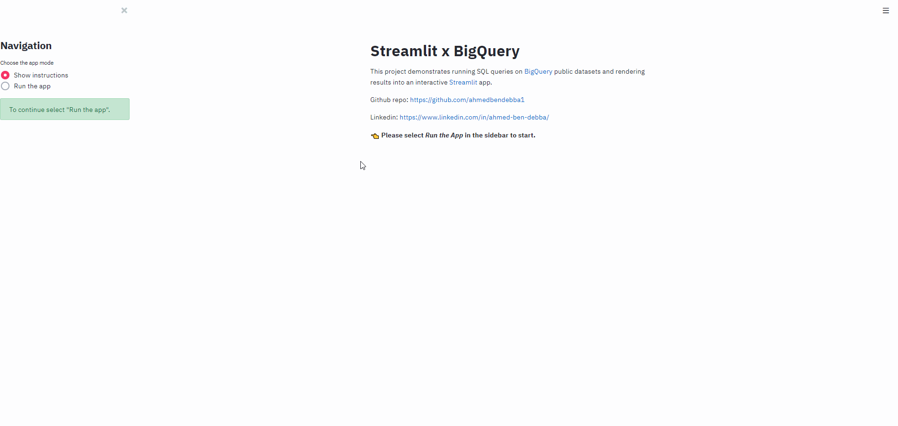
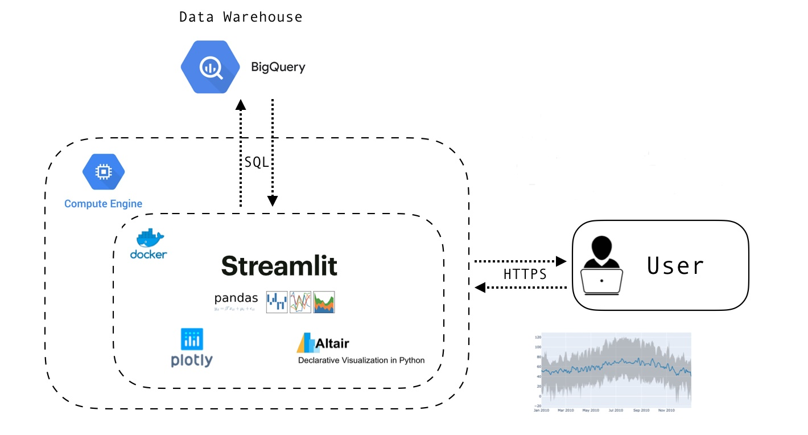

# Weather-data-visualization
Interactive SQL queries on BigQuery with Streamlit. This project demonstrates running SQL queries on [BigQuery](https://cloud.google.com/bigquery/) public datasets and rendering results into an interactive [Streamlit](https://streamlit.io) app. 

Live version: http://34.76.236.119/



# Architecture



# Running on local machine 

To run the application, build the docker image and run it using the following commands

```
docker build -t app .
```

```
docker run --rm -p 8080:8080 app:latest
```

The application will be available on http://0.0.0.0:8080. 

**Note:**
In order to use BigQuery API in python, we need to create a credential file (JSON file) and declare its path as an environment variable `GOOGLE_APPLICATION_CREDENTIALS` (by default defined in `modules/data_query.py`). 
To create the credential file follow steps explained here: https://cloud.google.com/bigquery/docs/quickstarts/quickstart-client-libraries


# Running on cloud

- Build image and push it to a PRIVATE  Container Registry (don't forget about your credentials) .

From a GCP project, we will use Google Shell to build the image and push it to GCR (container registry).

```
# Get name of project 
# For illustration we will call it PROJECT-ID

gcloud config get-value project
```

Create the following Dockerfile in your CloudShell session .

```
FROM ahmedbendebba/weather-visualisation:latest

# Google Run uses env variable PORT 

CMD gunicorn --bind :$PORT wsgi:app
```

Finally, we can build and submit the image to GCR.

```
gcloud builds submit --tag gcr.io/PROJECT-ID/weather-visualisation
```

- Create an instance on Google Compute Engine
- 
- Deploy on Google Compute Engine by running this image gcr.io/PROJECT-ID/weather-visualisation

```
export GCR_TAG=gcr.io/PROJECT-ID/weather-visualization1 

docker run -p 80:8080 -e PORT=8080 $GCR_TAG
```

# Code

- `app.py` : Streamlit script to define the UI. 

Modules: 

- `modules/data_query.py`: Define Data fetcher from BigQuery (takes an SQL command and return results in Pandas DataFrame).

- `modules/sql_queries.py`: Pre-defined parametrized SQL commands. 

- `modules/utils.py`: Contains a  a function to compute size of data anluzed by a given query. 

- `modules/plot.py`: Plot functions. 


--- 
By Ahmed


